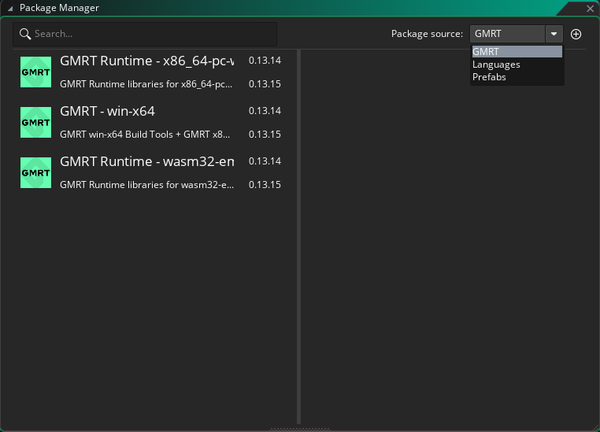
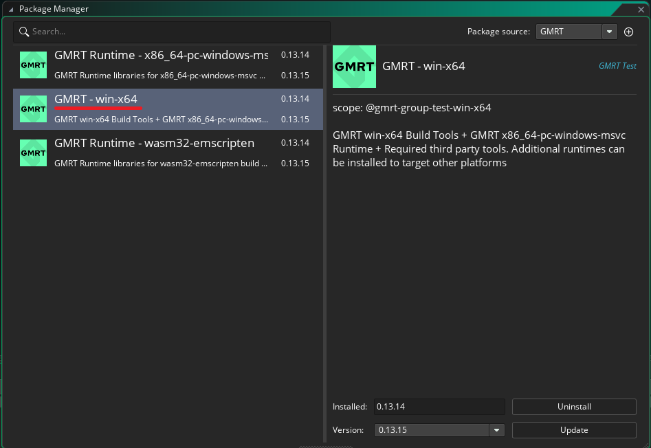
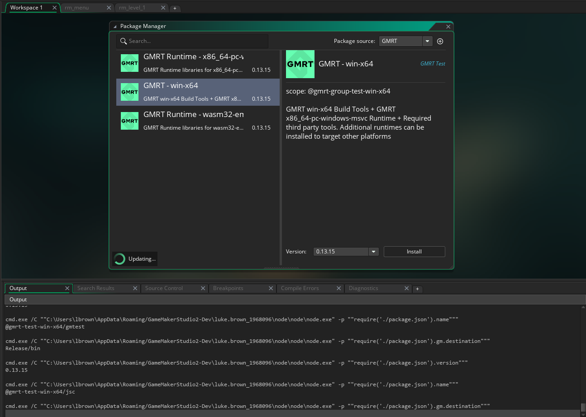
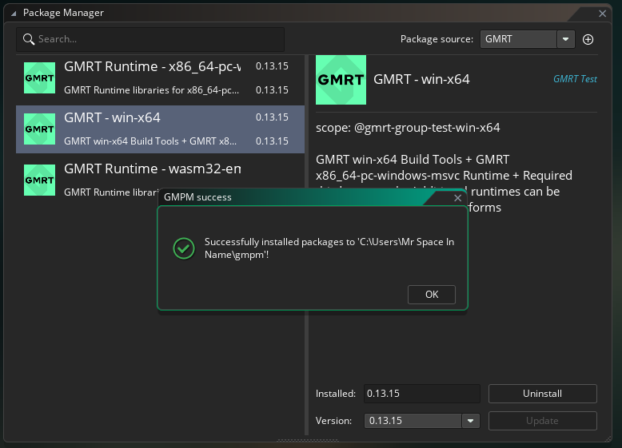
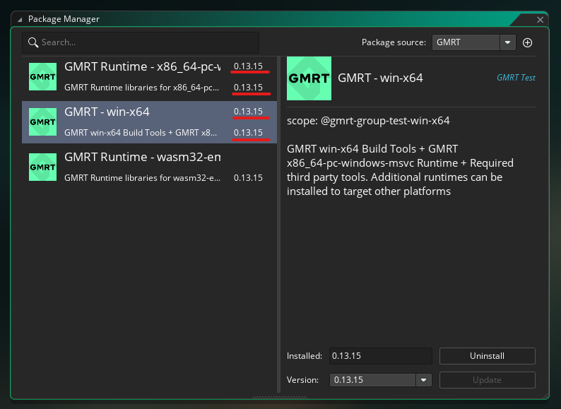
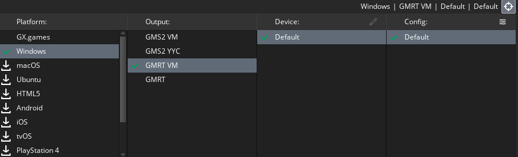
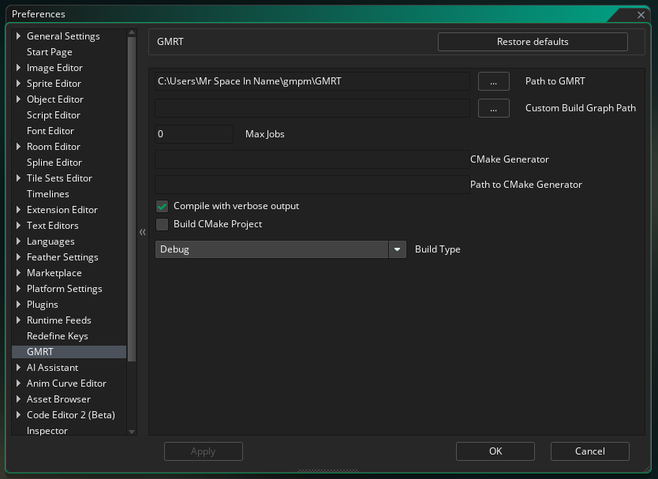
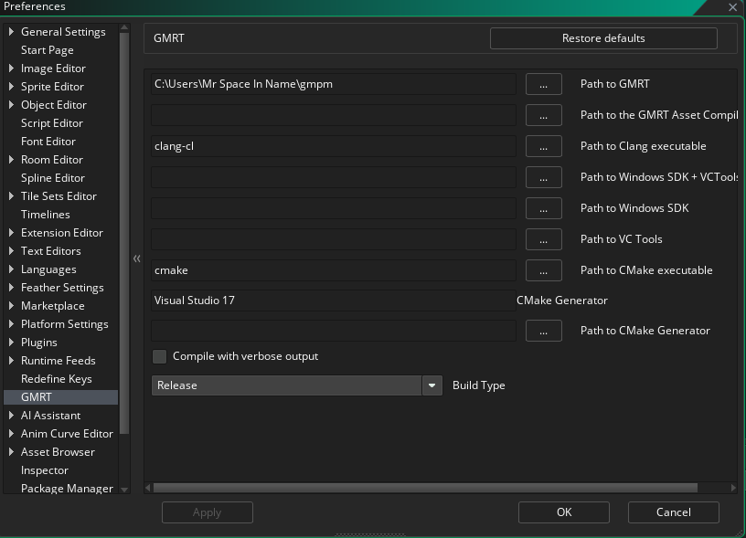

GMRT (Beta)/GMPM Setup Instructions 

# Overview

GameMaker's GMRT (codename “Cronus” - which you may see some references to) is an entirely new toolchain and runtime library, which sits alongside and will eventually replace the existing VM and YYC runtimes

It aims to deconstruct the monolithic architecture of the current toolchain and runtime, providing more ways in which the GameMaker team and GameMaker users can expand and use the tools and runtime. In addition, the goal of GMRT is to leverage the power of tools such as CMake, LLVM and the Clang compiler to improve the overall performance of games, allow better support for third party libraries and tools, and make expanding the runtime easier for everyone.\
While we are still only in the early stages of development, we invite you to help us test and evaluate the new toolchain and runtime to help us focus on what's most important to you as a developer.

Here are some major features we're hoping that the new toolchain will bring us in the coming years:

- Allow easier development of GM/user built tools to expand the toolchain

- Allow easier development of GM/user built libraries to expand the runtime

- Increased performance at the core level through static analysis and LLVM

- Provide tools to easily convert a native library into an extension using a single IDL declaration file

- Implement a new, customisable render pipeline

- Allow for WAD files to be created using the runtime and add support for multiple WAD files

- Allow developers to use other development tools such as Visual Studio to develop and debug their games, providing Intellisense functionality through a custom GML LSP server

For the initial stage, we are focusing on only a very limited number of targets: _Windows_  and _GX.games._ As we progress we will add support for other targets such as mobile and consoles.

# About GMRT And Toolchain

While we believe the changes we are making will give us a better base to provide better tools and a more customisable and optimised runtime, GMRT is currently an early work-in-progress, and as such, many of the elements to the toolchain are not optimised. Below are some examples we feel we should point out so that you know what to expect.

The current runtime consists of one monolithic library which is linked with the project at compile time in order to provide all GML functionality, script execution, windowing, etc. GMRT breaks this monolithic structure, meaning that you have the option to include only the libraries that your project needs, potentially vastly reducing your game’s executable size at the cost of increased linking time when linking with all the runtime libraries. Currently there is no IDE support for this but it can be achieved by only pulling the required library packages. A list of these packages will be provided for those wishing to experiment with limited libraries.\
Currently GMRT is compiled-only, meaning it operates in much the same way as the YYC target does in the current runtime. VM execution will be implemented at a later stage.

The toolchain has undergone a similar transformation. WAD-generation functionality has been moved to the runtime. Our hope for the future is that this allows WADs to be created by GML projects at runtime and used within the running application or exported. This functionality is at the very early stages. The result of this is that an asset compiler can be a GML project itself! And indeed, that is what our packaged asset compiler tool is while we develop the WAD runtime library. The downside of this process right now is that there is only limited caching currently being done of generated assets, meaning that each time the project is run, this process will be invoked and some assets will be unnecessarily regenerated. This is something that we will be addressing soon.

Our Windowing, IO, and Rendering pipelines have been completely rewritten, leveraging Google’s “Dawn” project and SDL2. We’re working closely with Google to hopefully provide a very extensible and fast rendering solution which will allow us to target new graphics APIs and systems much quicker than previously. While mostly functional, the rendering pipeline is currently unoptimised and will result in some additional latency brought on by unnecessary draw calls and copying of buffers.

# Known Issues

Currently, integration within the IDE’s debugger is not yet functional. We’re focusing on providing more tools for developers such as the inclusion of an LSP server which will allow developers to write code within any other LSP-supporting IDEs.

When building, the toolchain will build a VS project for the compiled game which can be used to perform some basic debugging. This process is described below.

A large portion of the work on GMRT has been implementing a compatibility layer between the current runtime and the new one. Currently, around 75% of the GML runtime functions, properties, and constants have been ported (excluding platform specific ones), with a reliance on automated testing and limited QA testing. As such, we anticipate many games will fail due to missing or broken functionality within this compatibility layer. We have provided a separate document, that we will update as progression is made, which outlines which features are missing or known to be broken. [Known Issues - Closed Beta](https://docs.google.com/document/d/e/2PACX-1vSQbWWqxT5eZtP1huG2WqASmMm8_gdAYMsZzxcDVxpVmogG4zpbKHSLfX718OTTSb2a6jyV-wPj_KiL/pub)

Please feel free to provide feedback on anything addressed here. Even though these issues are known and being addressed, we would like to identify which areas most affect our users.

# Areas We Would Like Feedback On

Any issues relating to runtime features or the tools are greatly appreciated. For this beta, there are some specific areas we would like to see your focus concentrated on:

- Broken or misbehaving GML functions (Likely to be a large number of issues)

- Event ordering issues (Event invocation has changed which may lead to issues for projects which relied on undocumented event orders in the current runtime)

- Rendering issues in-game

- Audio issues in-game

- Performance issues when building GMRT projects and in-game (many of these are known but we would like to hear of any specific cases - example projects are much appreciated)

- GML Language/Compiler issues (The new toolchain implements an entirely new GML compiler. We are aware of some issues and will be addressing them shortly)

- Asset Compiler issues (As previously mentioned, the asset compiler is currently a test project for GMRT’s WAD library. This is not optimised as we focus on compatibility and features)

- Issues running any of the toolchain tools.

- IDE Debugger. While we have implemented basic IDE debugging, this is only at its first stage and there will likely be a number of issues, incorrect values, and possibly crashes related to this

# How To Report Issues

Once you have received and accepted the invite to the GMExternal/NewRuntimeBeta GitHub repo you can submit issues using one of the available [Issue templates](https://github.com/GMExternal/NewRuntimeBeta/issues/new/choose).

The main issue type that you should use is the [In-Game Bug Report](https://github.com/GMExternal/NewRuntimeBeta/issues/new?assignees=\&labels=runner-bug\&projects=\&template=in_game_bug_report.yml) as this GitHub repository is specific for issues regarding the new GMRT runtimes, although there may be reasons to submit Build Failure or IDE issues as well if they _only_ occur when compiling games using GMRT.

Please fill out as much information as you can within these reports, as the more information you provide, the easier it will be for us to resolve your issues.

**It's recommended that you enable verbose outputs for GMRT if you encounter any issues, as these logs will help the GMRT team correctly identify your issue. This can be done by enabling the “Compiler with verbose output” checkboxes in _File > Preferences > GMRT._ This is described in more detail in the _troubleshooting_ section of this document.**

# Discussing GMRT

While you are free to add information to or discuss issues via their comments, we have also worked with the admins on the [GameMaker Discord Server](https://discord.gg/gamemaker) to set up a place for open discussion about anything related to the New GameMaker Runtime.

Feel free to discuss anything related to GMRT in either the [#new-runtime-beta](https://discord.com/channels/262834612932182025/1082693121776820254) channel or by creating a post in the [#new-runtime-beta-forum](https://discord.com/channels/262834612932182025/1082693536803209289) channel.

The only thing that we ask for now is that you keep your discussions of the GMRT to these channels and do not discuss details of GMRT with users who have not yet received an invite to the beta.

# IDE Beta Download

GMRT is available in all GameMaker Beta builds from version 2023.600.0.339 onwards. We highly recommend keeping the beta up to date as we may change the IDE from time to time as things progress.

You can download the beta here:

<https://gms.yoyogames.com/ReleaseNotes-NuBeta.html>

**Note**: If you already had the beta installed you may have to use the Update Licence button in the account menu before the GMRT target becomes available in target manager.

**Note:** The current installer for GameMaker Betas  contains a checkbox for “Dependencies for New Runtime (Beta)””. This is the **old** method of installing dependencies and is not recommended anymore. If you install these by accident it’s recommended that you uninstall them before continuing with the setup. The new method for installing third party dependencies uses the package manager, as described in more detail below.

# IDE Setup (GMPM/Package Manager)

GMPM (GameMaker Package Manager) is a new tool which acts as a frontend to the “npm” and “conan” package managers and adds some additional functionality to those package managers to enable GameMaker to use the installed packages.

GMPM is how we intend to distribute GMRT. It aims to decouple the IDE and allow game projects to specify their version. For now, the packages are shared by all projects, but we want to provide the option for individual projects to specify their runtime and toolchain versions down the line.

The tool takes a given package manifest file, similar to an npm package.json manifest and will download and install the specified versions of tools and runtime packages for use in GameMaker. Special keywords are used inside braces ‘{ }’ to specify a package’s build type and target.

- Open the IDE

- Open any project - (Note: In the future, games may have their own versions of the runtime and install specific packages and package versions, so the GMPM output is shown in the “Output” Window. This window is only present when a game project is open)\
  

- Open _Tools > Package Manager_

____

____

____

- The package manager is intended in the future to be used for much more than GMRT but just now it contains every package you will need to start using GMRT. Packages come in two kinds:

  - Regular packages containing files and resources

  - Meta Packages - These are often empty packages which will trigger the install of other packages as their dependencies. This simplifies what you need to install and ensures that you get everything needed for GMRT

- Within the package manager you will see a lot of packages. You can install all the necessary packages using the GMRT metapackage and the third party packages. These are the 5 packages you should install (Underlines in the screenshots above in **red**).

  - **gmrt** - _This meta package will install all other packages except for the third party tools packages. You will notice after installing this package that many other packages are also installed._

  - **clang**

  - **cmake**

  - **ninja**

  - **visualstudio-sysroot**

- You can install these packages by simply clicking on each package and clicking the “Install” button.

- From the right-hand panel you can also select different versions of the packages but it's recommended to install the latest version for the initial setup unless instructed otherwise. (The latest version should be selected by default.)

- While a package is installing, you should see the output from GMPM in the console window and a spinning “Updating” icon at the bottom of the package manager window:\
  

- If a package finishes its install successfully you will see a confirmation popup:\
  

- After dismissing the confirmation popup, you should see that the “installed version” of all the new packages is now set:\
  \
  This indicates that the package has been installed successfully and that the IDE is able to read from it.

- Repeat this for **all 4 packages** mentioned above. Once done, you should be ready to build using GMRT****

- If you notice a package failed to install, check the output log to see why it failed. You may need to check your antivirus/OS permissions and, if necessary, delete the gmpm folder when GameMaker is closed and then reinstall if you run into repeated issues.

# Building with GMRT

- Change target to Windows > GMRT

- Run

# Additional Preferences

Within the Preferences window you should see two new sections: **Package Manager** and **GMRT**. There you will find options for changing the defaults for GMRT and Package Manager, but you shouldn’t need to change them from the default values. They are described in more detail later in this document.

### GMRT Preferences

This section contains the Preferences for the new GMRT runtime itself. For the most part this doesn't need to be changed but you may wish to modify one of these fields if you would like to build your projects as Visual Studio solutions to debug and compile outside GameMaker. This is explained in more detail later in this document.\

### Package Manager Preferences

Similar to above, you should not need to change these preferences, however they are useful if you wish to install packages to a different location than the default. If you do change this, make sure to change the “Path to GMRT” path in the GMRT preferences to point to this new location so that GMRT can find the necessary packages.\
The Default Source URL shown here is for our current package registry used for GMRT and should be set already.

# 

# Troubleshooting

This is a beta after all and that means there are going to be some issues. Below are some potential issues that may arise and some potential solutions to resolving these issues.

A general good rule to try if first encountering an issue after the initial setup is to try and **build an empty project** with just a single room. If this succeeds but fails to build your specific project then the issue is likely a bug in our system. Please submit a bug report to the GMRT team.

Additionally, it's recommended when encountering any issues to enable verbose GMRT outputs and then build your project so it fails again, as described earlier in this document. This will give you a more complete breakdown of what GMRT is doing and is useful information for the GMRT team to address your issue.

### GMPM (Package Manager)

- **Package Manager won't open when I click Tools > Package manager:** Package manager is currently tied to your account, since you need access to GMRT to view it. Close down and reopen the GameMaker IDE again, and log in again if requested. Once GameMaker has restarted, the package manager should then show up when you press it. This issue will be addressed before the full release of the package manager.

- **Network Issues:** One of the more common issues relating to packages are network issues, since GMPM can take a while to pull down the required components. GMPM should output information in the GameMaker IDE “Output” window. From this you should be able to see progress as packages are being installed - but on particularly slow connections this may take some time to complete.

- **Backend Issues:** GMPM could simply be down or busy. While in beta we’re using quite a small backend server, but we will be increasing this at a later point. If you believe this to be the issue please inform the GMRT team via Discord and we will look into it as soon as possible.

### Build Issues

When trying to resolve build issues, please delete the “Build” folder from your project directory before trying again, as cached data from an existing build directory can continue to cause failures even after the initial issue has been addressed.

- **“Clean” is not working:** Clean has not yet been implemented. You will need to clean manually by deleting the “Build” folder in your project directory and deleting the asset cache directory, which defaults to Documents/GameMaker/Cache/\<game name>\
  All these issues will be resolved by the time of full release.

- **GMC/GMLC - Compiler issues:** We’re aiming to be as compatible as possible with the current version of GMS2 Runtimes; however, we have built a new compiler from the ground up so there may be some issues. Please report this as a bug to the GMRT team.

- **Duplicate Symbol linker Issues:** If you notice a lot of “duplicate symbol” errors in the output window then this is often down to us moving things between libraries and GMPM not correctly removing redundant or old libraries. If this is the case then a simple brute-force fix for this is to delete your gmpm install folder and then reinstall the latest versions of the GMRT libraries.

### Using already installed third party tools

By default, GMRT will attempt to search the \`GMPM\` install directory for the third party tools. However, as a developer you will likely have these installed along with Visual Studio. To use these instead of defaults, set the following options in the \`GMRT\` preferences window:

- **Path to Clang executable** : Assuming clang is accessible in PATH, set this to **"clang-cl"** (or alternatively "clang", clang-cl is the windows shim for clang)

- **Path to CMake executable** : Assuming cmake is accessible in PATH, set this to **"cmake"**

- **CMake Generator** : If Visual Studio 2022 is installed, setting this to "**Visual Studio 17**" will use visual studio as the generator. This will create a valid VS 2022 solution which can be used to debug and run the build executable once generated

# Debugging Using Visual Studio

Compiling and running from within other IDEs is a core feature of the new toolchain. More tools for this will be made available in the coming months. We’re aiming to provide a fully-functional LSP server with the same functionality already present within the GameMaker IDE.\
It is already possible to compile and debug your game using Visual Studio, albeit without the error messages, syntax highlighting, and code completion that the GameMaker IDE provides. This is a work in progress but any feedback is appreciated.

Down the line, we’re planning on providing access to the source for the runtime modules. Our hope is that this not only helps developers debugging but also aids in development of the runtime. We will go into this in more detail in the coming months.

- Download and install **Visual Studio Pro/Community** **_v17.5_**

  - **_Note that it must be v17.5 or that the 17.5 tools are included. You can find this in the visual studio installer by searching for 17.5\
    **__**\
    Latest versions of VS may be supported but this is the latest tested version. Feel free to try with a newer version and let us know the result._**

  - **_Make sure you install the build tools for C++\
    **__**_**

- In the GMRT preferences window, enter “Visual Studio 17” as the generator in the “CMake Generator” input box\
  \
  This will tell GMRT to build your application using visual studio as opposed to the default.

- Inside your project directory you will find a _"Build"_ folder has been added after building from within GameMaker

- Inside this folder is another _"build"_ folder containing the generated VS project

- Open this project\
  

- You can run and rebuild the project inside Visual Studio **(note that you need to select "Build/Rebuild Solution" to rebuild correctly when scripts have been changed)**

- **If you change an asset or add something to the project, the VS build won't trigger the asset compiler automatically so you will need to rebuild in GameMaker first - This will be fixed soon**

# Debugging Using Visual Studio - Troubleshooting

If building from the IDE fails when using the Visual Studio generator there is another way that may work. This requires having Visual Studio 2022 installed and using the VS command prompt, as this prompt sets up the necessary environment variables used to build with VS.

- If this step fails with an error similar to: `CMake Error: CMAKE_C_COMPILER not set, after EnableLanguage` then you will need to try and build using the x64 native command line

  1. search for `x64 Native tools command prompt for VS 2022` in the start bar, open that.\
     

  2. Copy and paste the command which appears in the gamemaker “Output” Window when you try to run as described above. it should look similar to this but using your directory name and project name:\
     _"C:\\.gmpm\Release\bin\yypcd.exe" "C:\Users\\\<username>\Documents\GameMakerStudio2\\\<project name>\\\<project name>.yyp" -o "C:\Users\\\<username>\Documents\GameMakerStudio2\\\<project name>\Build" -t "C:\\.gmpm\Release\bin\cmake-project-template" -toolchain="C:\\.gmpm" -v -target-triple=x86\_64-pc-windows-msvc -asset-compiler=C:\\.gmpm\Debug\bin\AssetCompiler.exe -asset-compiler-args=--nowad --headless --noloop_
