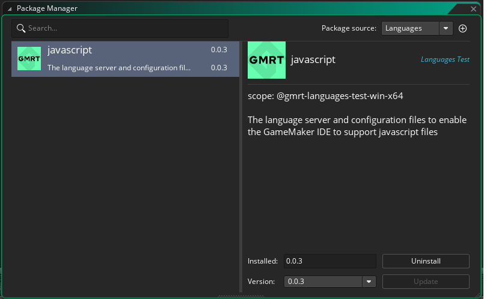
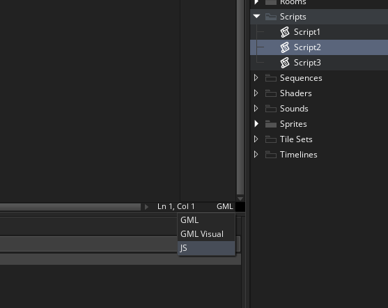
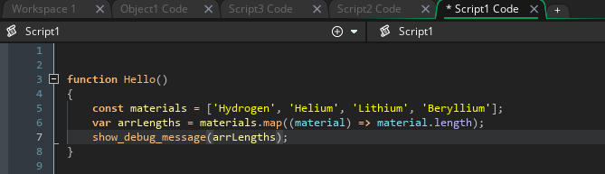
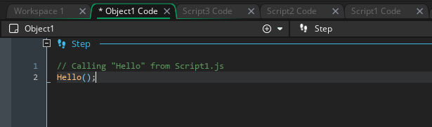
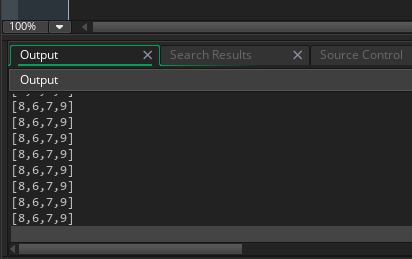

# GameMaker Javascript Language

## Overview

**Javascript as a language in GameMaker is currently an experimental feature and as such is likely to change significantly over time. It is highly discouraged to use this feature in any production games at this point and should only be used for experimentation and testing.**

**We encourage you to give us feedback and any thoughts you may have, particularly relating to the interop between javascript and gml/GMRT**

GMRT already provides the necessary libraries and tools for compiling javascript and provides a partial implementation of the javascript ES2020 runtime library. That means most javascript functions should be available.

However, there are some features missing that will require more development, such as "eval"

Currently, Javascript is restricted to being used within Scripts, and cannot be used for GM Object Events. This is a restriction while we focus on interop but we will be working on integrating Javascript into GM Object Events at a later date.

## Setup

To be able to use javascript as an alternative scripting language you will need to install the javascript language package from the package manager. This will provide intellisense and additional language support for javascript within GameMaker.

The package is located within the `Languages` package source, selectable from the drop down menu at the top of the Package Manager window.

## Usage

Once installed, you should have everything needed to start using Javascript within Scripts.

Start by creating a new Script, `Script1` and opening this script within the Code Editor window.
The script will default to a `.gml` script.

Select the drop down at the bottom of the code editor with this script open and select `JS` to convert the script to a `.js` script.

Now that you have a `.js` script file, we can start coding in Javascript!
As well as being able to javascript runtime functions, you can also access GML functions.

Over time we may restrict or expand the subset of gml runtime functional accessible from within Javascript scripts as we develop javascript further and solidify the JS-GML interop

Below is an example of a javascript function. Note how we are using `show_debug_message` directly from within javascript.

Using these script functions works just as it does with `.gml` scripts.

Create a new GM Object, `object1`, and add a `Step` event to this object. Place this object in a Room.
Within this step event you can call the Javascript function directly.

For example:

You are now ready to compile. Select the `GMRT` target and Build + Run your project.

Once the project builds and loads you should see output within the console window.

And that's it! This is just a start and there's a lot of work still to do but we'd love to get your early thoughts. We will be providing more information as we develop this more in the future.