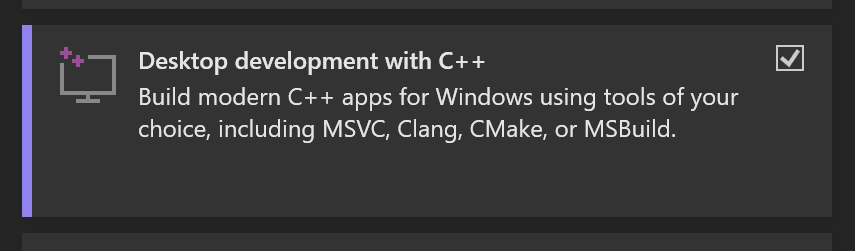
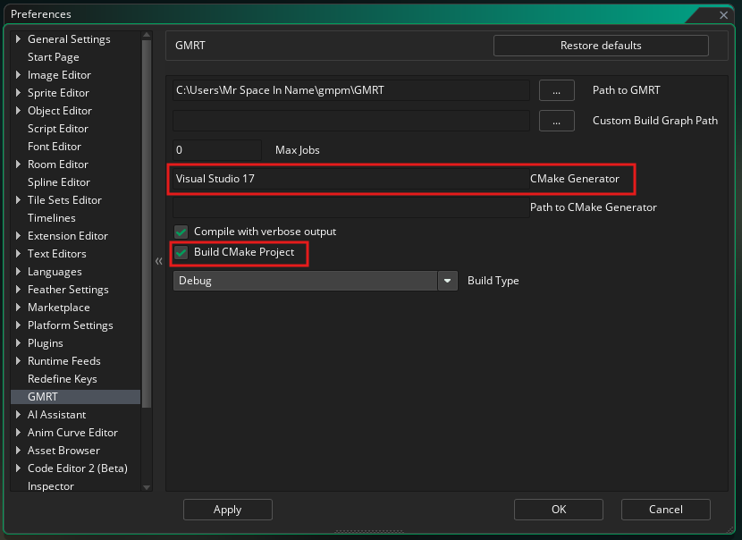
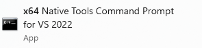
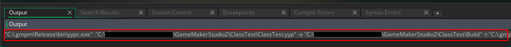

# Setup instructions and documentation for win-x64 platforms

## Overview

This document goes over the setup steps for the win-x64 platform of GMRT and its targets and assumes you're already familiar with the basics of GMRT and packages
For information on GMRT, installing packages, and the purposes of the `GMRT - <Platform>` and `GMRT Runtime - <Target>` packages, please see the [Introduction to GMRT](../../introduction/GMRT-beta-intro-and-setup-instructions.md) documentation

## GMRT - win-x64

To install the platform tools and the runtime required for building for this target, you must install the `GMRT - win-x64` package
This package includes:
  - GMRT toolchain binaries for win-x64
  - Third party dependencies for the win-x64 toolchain
  - The GMRT Runtime for win-x64 (x86_64-pc-windows-msvc)
  - Third party dependencies for the win-x64 runtime (x86_64-pc-windows-msvc)

## Building for Windows (GMRT Runtime - x86_64-pc-windows-msvc)

Building for windows x64 is supported by the `GMRT Runtime - x86_64-pc-windows-msvc` package.
Once installed, this package should allow you to select `windows` as a target for GMRT from the IDE.

This runtime also provides functionality for building a Visual Studio solution using cmake which can be useful for debugging purposes. We plan to expand this functionality later on.

<hr>

### Debugging Using Visual Studio

Compiling and running from within other IDEs is a core feature of the new toolchain. More tools for this will be made available in the coming months. We’re aiming to provide a fully-functional LSP server with the same functionality already present within the GameMaker IDE.

It is already possible to compile and debug your game using Visual Studio, albeit without the error messages, syntax highlighting, and code completion that the GameMaker IDE provides. This is a work in progress but any feedback is appreciated. Down the line, we’re planning on providing access to the source for the runtime modules. Our hope is that this not only helps developers debugging but also aids in development of the runtime. We will go into this in more detail in the coming months.

- Download and install **Visual Studio Pro/Community** **_v17.5_**

  - **_Note that it must be v17.5 or that the 17.5 tools are included. You can find this in the visual studio installer by searching for 17.5\
    **__**\
    Latest versions of VS may be supported but this is the latest tested version. Feel free to try with a newer version and let us know the result._**

  - **_Make sure you install the build tools for C++\
    **__**_**

- In the GMRT preferences window, check the "Build CMake Project". This will ensure that the CMake build job is executed for the selected build target.
  For more information on build jobs, see the [Build Graph](../../toolchain/buildgraph/Build-Graph.md) documentation

- In the GMRT preferences window, enter “Visual Studio 17” as the generator in the “CMake Generator” input box\
  \
  This will tell GMRT to build your application using visual studio as opposed to the default
  This can be set to any valid cmake generator. In some cases you may need to point CMake to the generator using the "Path to CMake Generator" property field 

- You can build for CMake wither either GMRT or GMRT VM options, but GMRT is recommended if you want to debug you gml code within an external editor such as Visual Studio

- Inside your project directory you will find a _"Build"_ folder has been added after building from within GameMaker

- Inside this folder is another _"build"_ folder containing the generated VS project

- Open this project\
  

- You can run and rebuild the project inside Visual Studio **(note that you need to select "Build/Rebuild Solution" to rebuild correctly when scripts have been changed)**

- **If you change an asset or add something to the project, the VS build won't trigger the asset compiler automatically so you will need to rebuild in GameMaker first - This will be fixed soon**

<br>

#### Debugging Using Visual Studio - Troubleshooting

If building from the IDE fails when using the Visual Studio generator there is another way that may work. This requires having Visual Studio 2022 installed and using the VS command prompt, as this prompt sets up the necessary environment variables used to build with VS.

- If this step fails with an error similar to: `CMake Error: CMAKE_C_COMPILER not set, after EnableLanguage` then you will need to try and build using the x64 native command line

  1. search for `x64 Native tools command prompt for VS 2022` in the start bar, open that.\
     

  2. Copy and paste the command which appears in the gamemaker “Output” Window when you try to run as described above. it should look similar to this but using your directory name and project name:\
     _"C:\\.gmpm\Release\bin\yypcd.exe" "C:\Users\\\<username>\Documents\GameMakerStudio2\\\<project name>\\\<project name>.yyp" -o "C:\Users\\\<username>\Documents\GameMakerStudio2\\\<project name>\Build" -t "C:\\.gmpm\Release\bin\cmake-project-template" -toolchain="C:\\.gmpm" -v -target-triple=x86\_64-pc-windows-msvc -asset-compiler=C:\\.gmpm\Debug\bin\AssetCompiler.exe -asset-compiler-args=--nowad --headless --noloop_
<br>


## Building for WASM (GMRT Runtime - wasm32-emscripten)

Building for windows x64 is supported by the `GMRT Runtime - wasm32-emscripten` package.
Once installed, this package should allow you to select `wasm` and `GX.games` as a target for GMRT from the IDE.

When executed, GMRT should open your default browser. You will need to ensure that this browser has `wasm` and `webgpu` enabled.


## Building for Linux (GMRT Runtime - x86_64-linux-gnu)

Building for windows x64 is supported by the `GMRT Runtime - x86_64-linux-gnu` package.
Once installed, this package should allow you to select `Ubuntu` as a target for GMRT from the IDE.

As with the GMRT, you have the option to provide the IDE with a connection to a ubuntu host machine.
GMRT in win x64 also provides support for executing on (Windows Subsystem for Linux) WSL which is provided as the default host

### Setup for Windows Subsystem for Linux (WSL)

- Install [Ubuntu 22.04 on WSL2](https://documentation.ubuntu.com/wsl/en/latest/howto/install-ubuntu-wsl2/)
- Open the ubuntu terminal
- Ensure ubuntu is fully updated. Run `sudo apt-get update && sudo apt-get upgrade` in the terminal
- Test an x11 app:
    - Run `sudo apt-get install x11-apps` in the terminal
    - Run `xcalc`. The xcalc application should appear
- Install SDL2.0 - Run `sudo apt-get install libsdl2-2.0`
    - Currently this is the only additional install required for GMRT as it is not packaged within the generated AppDir due to it's dependency on wayland
    - The version of SDL we expect `Ubuntu on WSL2` to install here is SDL v2.0.20. You can check this is the case by running `apt-cache policy libsdl2-2.0-0` after installing:
      ```
      libsdl2-2.0-0:
      Installed: 2.0.20+dfsg-2ubuntu1.22.04.1
      Candidate: 2.0.20+dfsg-2ubuntu1.22.04.1
      Version table:
      *** 2.0.20+dfsg-2ubuntu1.22.04.1 500
             500 http://archive.ubuntu.com/ubuntu jammy-updates/main amd64 Packages
             100 /var/lib/dpkg/status
          2.0.20+dfsg-2build1 500
             500 http://archive.ubuntu.com/ubuntu jammy/main amd64 Packages
      ```
      If this version does not match, you may need to specify the SDL version or change the SDL version used in the `Run` action as part of the GMRT prod build graph. See the [Build Graph](../../toolchain/buildgraph/Build-Graph.md) documentation for more information
